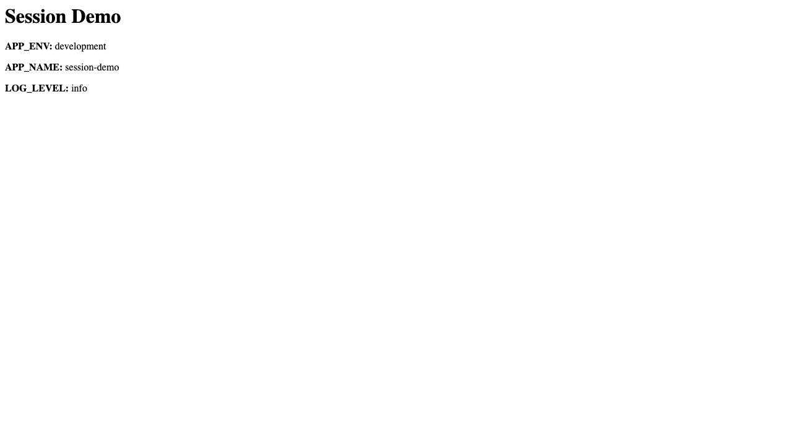

# oyd-exercise-2-1

Despliegue de una aplicación Node.js en Kubernetes local (Docker Desktop con Kubernetes habilitado), usando manifiestos versionados y configuración por `ConfigMap`.

## Objetivo

Containerizar una aplicación web y desplegarla en el namespace `webapp`, cumpliendo con:

- `Deployment` con 2 réplicas
- imagen `session-demo:1.0`
- `imagePullPolicy: Never`
- variables de entorno inyectadas desde `ConfigMap` vía `envFrom`
- requests/limits de CPU y memoria
- `Service` `ClusterIP` en puerto `8080` hacia `3000`

## Archivos entregados

- `app.js`
- `package.json`
- `Dockerfile`
- `k8s/namespace.yaml`
- `k8s/configmap.yaml`
- `k8s/deployment.yaml`
- `k8s/service.yaml`
- `evidence/k8s-run.png`

## Build de imagen

```bash
docker build -t session-demo:1.0 .
docker images
```

## Validate and apply

```bash
kubectl apply -f k8s/ --dry-run=client
kubectl apply -f k8s/
kubectl get pods -n webapp
```

## Verificación funcional

```bash
kubectl port-forward svc/webapp-svc 8080:8080 -n webapp
```

Abrir en navegador:

- http://localhost:8080

Valores esperados en la página:

- `APP_ENV: development`
- `APP_NAME: session-demo`
- `LOG_LEVEL: info`

## Evidence


